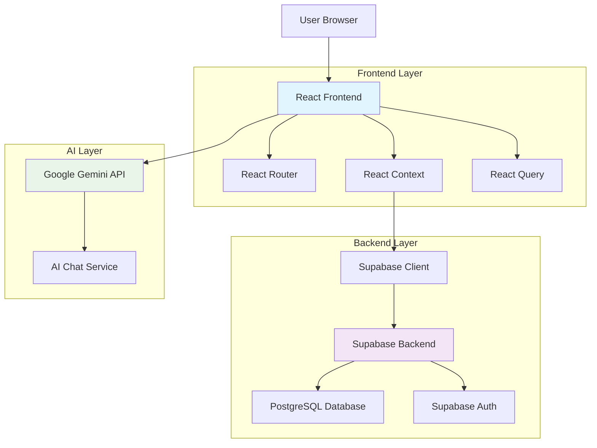
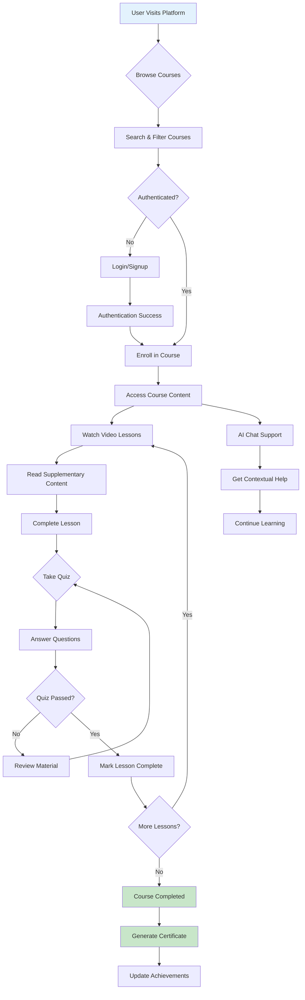
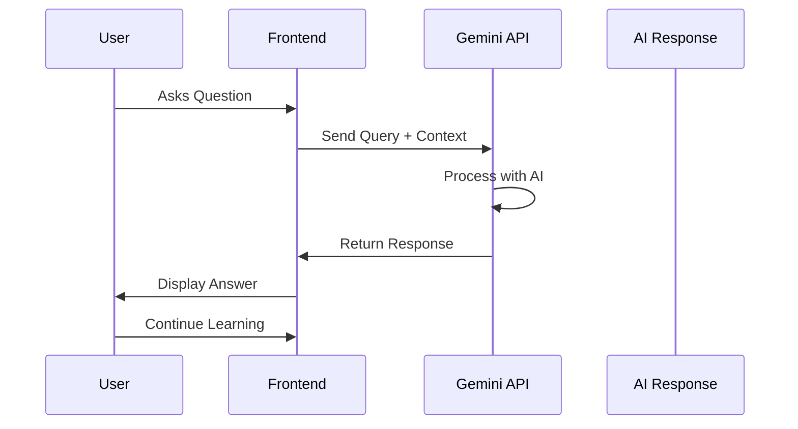

# E-Smart Learning

## Overview

E-Smart Learning is a modern, AI-powered e-learning platform designed to provide an interactive and personalized learning experience. The platform offers a comprehensive course catalog with video lessons, interactive quizzes, progress tracking, and AI-assisted learning support. Built with cutting-edge web technologies, it enables learners to master new skills through structured courses while receiving intelligent assistance from AI.

## Stack

### Frontend
- **React 18** - Component-based UI framework
- **TypeScript** - Type-safe JavaScript
- **Vite** - Fast build tool and development server
- **Tailwind CSS** - Utility-first CSS framework
- **shadcn/ui** - Modern UI component library
- **React Router** - Client-side routing
- **React Query** - Data fetching and caching
- **React Hook Form** - Form handling with validation

### Backend
- **Supabase** - Backend-as-a-Service platform
  - PostgreSQL database
  - Authentication system
  - Real-time subscriptions
  - Row Level Security (RLS)

### AI Integration
- **Google Gemini API** - AI-powered learning assistance

### Development Tools
- **ESLint** - Code linting
- **PostCSS** - CSS processing
- **Autoprefixer** - CSS vendor prefixing

## Architecture

The application follows a modern single-page application (SPA) architecture with a clear separation of concerns between frontend, backend, and AI services.

### System Architecture Diagram



### Frontend Architecture
- **Component Structure**: Modular React components organized by feature (courses, quizzes, AI chat, etc.)
- **State Management**: React Context API for global state (user, courses, authentication)
- **Routing**: Client-side routing with React Router for navigation
- **UI Components**: Reusable UI components built with shadcn/ui and Tailwind CSS
- **Data Fetching**: React Query for server state management and caching

### Backend Architecture
- **Database**: PostgreSQL with Supabase
  - Tables: profiles, courses, lessons, quizzes, enrollments, progress tracking, certificates
  - Row Level Security policies for data protection
- **Authentication**: Supabase Auth with email/password
- **API**: RESTful API through Supabase client

### Data Flow
1. User interacts with React components
2. Components dispatch actions to Context
3. Context calls Supabase API
4. Data flows back through Context to components
5. UI updates reactively

## Features

### Core Learning Features
- **Course Catalog**: Browse and search through available courses
- **Video Lessons**: Watch educational videos with progress tracking
- **Interactive Quizzes**: Test knowledge with multiple-choice and true/false questions
- **Progress Tracking**: Monitor learning progress across lessons and courses
- **Certificates**: Earn certificates upon course completion

### User Management
- **Authentication**: Secure login and signup system
- **User Profiles**: Personal dashboard with learning statistics
- **Enrollment System**: Easy course enrollment and management
- **Learning Streaks**: Track consecutive learning days

### AI-Powered Assistance
- **AI Chat**: Contextual AI learning assistant powered by Google Gemini
- **Smart Recommendations**: AI-driven course and content suggestions
- **Instant Help**: Get answers to questions about course material

### Additional Features
- **Responsive Design**: Works seamlessly on desktop, tablet, and mobile
- **Dark/Light Theme**: Customizable interface themes
- **Search & Filter**: Find courses by category, difficulty, or keywords
- **Achievement System**: Unlock badges and achievements

## Process Flow

### User Journey Flowchart



### Learning Workflow
```
Course Selection → Enrollment → Lesson Viewing → Quiz Assessment → Progress Update → Certificate Issuance
```

### AI Integration Flow



## Configuration

The application requires environment variables for external service integration. Create a `.env` file in the project root:

```env
# Supabase Configuration
VITE_SUPABASE_URL=your_supabase_project_url
VITE_SUPABASE_PUBLISHABLE_KEY=your_supabase_publishable_key

# AI Configuration
VITE_GEMINI_API_KEY=your_gemini_api_key
```

### Sample Configuration Values
- `VITE_SUPABASE_URL`: `https://your-project.supabase.co`
- `VITE_SUPABASE_PUBLISHABLE_KEY`: `eyJhbGciOiJIUzI1NiIsInR5cCI6IkpXVCJ9...`
- `VITE_GEMINI_API_KEY`: `AIzaSyA1B2C3D4E5F6G7H8I9J0K1L2M3N4O5P6Q7R8S9T0`

## Usage

### Development
```bash
npm run dev
```
Starts the development server with hot reloading at `http://localhost:5173`

### Production Build
```bash
npm run build
```
Creates an optimized production build in the `dist` directory

### Preview Production Build
```bash
npm run preview
```
Serves the production build locally for testing

### Code Linting
```bash
npm run lint
```
Runs ESLint to check code quality and style

## Installation

### Prerequisites
- Node.js (version 18 or higher)
- npm or yarn package manager

### Setup Steps

1. **Clone the repository**
   ```bash
   git clone <repository-url>
   cd e-smart-learning
   ```

2. **Install dependencies**
   ```bash
   npm install
   ```

3. **Environment Configuration**
   - Copy `.env.example` to `.env`
   - Fill in your Supabase and Gemini API credentials

4. **Database Setup**
   - Create a Supabase project
   - Run the migration files in `supabase/migrations/`
   - Update your environment variables

5. **Start Development Server**
   ```bash
   npm run dev
   ```

6. **Access the Application**
   - Open `http://localhost:5173` in your browser
   - Create an account or login to start learning

### Database Schema

The application uses the following main database tables:
- `profiles` - User profiles and learning streaks
- `courses` - Course information and metadata
- `lessons` - Individual lessons with content
- `quizzes` - Quiz definitions and questions
- `enrollments` - User course enrollments
- `lesson_progress` - Individual lesson completion tracking
- `quiz_attempts` - Quiz attempt records
- `certificates` - Course completion certificates
- `user_achievements` - Achievement and badge system

All user data is protected with Row Level Security policies ensuring data privacy and security.
